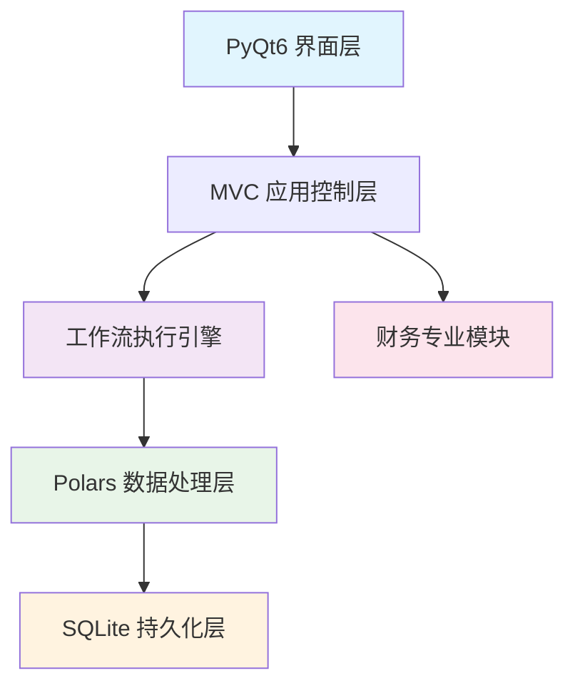

# 🚀 Data Workflow Automation Platform

> ⚠️ **项目重要声明 / Important Notice**
>
> **本项目由AI自主式代理（多阶段协作智能体）在无人类直接编写代码的情况下全程生成与演化。** 代码、架构、文档与测试内容均来源于自动化推理生成流程，当前版本定位为 **概念验证（Proof of Concept / Prototype）**：
>
> - 尚未经过真实生产环境与大规模业务数据验证。
> - 可能存在潜在逻辑缺陷、性能瓶颈或安全风险。
> - 不保证金融/会计等专业逻辑的绝对正确性。
> - 不建议直接用于合规、审计、风控或关键业务场景。
>
> **使用前请务必进行：代码审查 + 单元/集成测试 + 安全评估。** 适合：学习 / 研究 / 演示 / 二次开发。欢迎 Fork 与改进，并在 PR 中标注已人工复核范围。
>
> This repository was **entirely generated and iteratively evolved by autonomous AI agents** (no direct human code authoring). The current version is an **experimental prototype**:
>
> - NOT validated with production-scale workloads.
> - May contain architectural or logical flaws.
> - No warranty of financial/accounting correctness.
> - NOT for regulated, safety‑critical, or compliance use without hardening.
>
> **Perform independent review, testing, and security hardening before real-world adoption.** Human‑verified contributions are encouraged.
>
> （如需正式发布，请在人工深度校验后更新或替换本声明。）


<div align="center">

[](https://www.python.org/downloads/)
[](https://pypi.org/project/PyQt6/)
[](https://github.com/pola-rs/polars)
[](LICENSE)
[](#)

**专为个人用户设计的桌面可视化数据处理工作流平台**

*让数据处理变得简单高效，专注于Excel自动化和财务数据分析*

[🎯 核心特性](#-核心特性) • [🚀 快速开始](#-快速开始) • [📊 功能模块](#-功能模块) • [🏗️ 技术架构](#️-技术架构) • [📚 文档](#-文档)

</div>

---

## ✨ 核心特性

### 🎯 主要功能
- **🖱️ 拖拽式工作流设计**：可视化节点连接，无需编程知识
- **📊 Excel数据处理专家**：智能识别、清洗、转换Excel数据
- **💰 财务专业功能**：会计分录、价税分离、财务报表分析
- **⚡ 高性能处理引擎**：基于Polars，支持百万级数据处理
- **🎨 现代化界面**：PyQt6界面，支持深浅色主题切换

### 🔧 技术亮点
- **95种处理节点**：涵盖输入、处理、输出、工具、财务五大类完整功能
- **8层模块化架构**：清晰分层，便于扩展和维护
- **企业级性能**：启动≤5秒，内存≤2GB，100MB数据≤10秒处理
- **质量保障体系**：90%+代码覆盖率，全面测试验证

---

## 🚀 快速开始

### 📋 系统要求
- **操作系统**：Windows 10+ / macOS 10.15+ / Ubuntu 20.04+
- **Python版本**：3.9 或更高版本
- **内存**：4GB RAM（推荐8GB+）
- **存储空间**：500MB可用空间

### ⚡ 一键安装运行

```bash
# 1. 克隆项目到本地
git clone https://github.com/Moonaria123/data-workflow-automation.git
cd data-workflow-automation

# 2. 创建虚拟环境
python -m venv venv
# Windows
venv\Scripts\activate
# macOS/Linux
source venv/bin/activate

# 3. 安装依赖包
pip install -r requirements.txt

# 4. 启动应用程序
python main.py
```

### 🛠️ 开发环境配置

```bash
# 安装开发依赖
pip install -r requirements-dev.txt

# 运行测试套件
pytest tests/

# 生成覆盖率报告
pytest --cov=src --cov-report=html

# 启动调试模式
python main.py --debug
```

---

## 📊 功能模块

### 📥 输入节点 (20种)
| 类别 | 节点 | 描述 |
|-----|------|------|
| **文件输入** | Excel读取、CSV导入、JSON数据、文本文件 | 支持多种格式数据导入 |
| **数据库输入** | MySQL、PostgreSQL、SQLite、SQL Server | 企业级数据库连接 |
| **手动输入** | 表格输入、参数设置、日期选择 | 灵活的手动数据录入 |
| **网络输入** | REST API、GraphQL、FTP文件获取、邮件附件 | 网络数据源集成 |

### ⚙️ 处理节点 (35种)
| 类别 | 节点 | 描述 |
|-----|------|------|
| **数据清洗** | 去重、填充、标准化、异常值处理 | 全面的数据质量控制 |
| **数据转换** | 类型转换、格式化、编码转换 | 灵活的数据格式处理 |
| **数据计算** | 统计分析、数学运算、聚合函数 | 强大的数据分析能力 |
| **数据过滤** | 条件筛选、范围过滤、模糊匹配 | 精准的数据筛选 |
| **高级分析** | 机器学习、时间序列、异常检测 | 智能数据分析功能 |

### 📤 输出节点 (18种)
| 类别 | 节点 | 描述 |
|-----|------|------|
| **文件输出** | Excel导出、CSV保存、PDF生成 | 多格式结果输出 |
| **数据库输出** | 数据写入、备份保存 | 数据持久化存储 |
| **可视化输出** | 图表生成、报表制作 | 数据可视化展示 |
| **通知输出** | 邮件发送、消息提醒 | 结果通知推送 |

### 🔧 工具节点 (12种)
| 类别 | 节点 | 描述 |
|-----|------|------|
| **流程控制** | 条件分支、循环处理、延时等待 | 复杂流程控制 |
| **调试工具** | 数据检查、日志记录、性能监控 | 开发调试支持 |

### 💰 财务节点 (10种)
| 类别 | 节点 | 描述 |
|-----|------|------|
| **财务分析** | 价税分离、汇率转换、折旧计算 | 专业财务处理功能 |
| **会计处理** | 分录生成、科目映射、报表分析 | 会计专业工具 |

---

## 🏗️ 技术架构

### 核心技术栈


### 项目结构
```
📁 data-workflow-automation/
├── 📄 main.py                     # 应用程序入口
├── 📄 README.md                   # 项目说明文档
├── 📄 requirements.txt            # 生产依赖
├── 📄 requirements-dev.txt        # 开发依赖
├── 📂 src/                       # 源代码目录
│   ├── 📂 ui/                    # PyQt6界面层
│   │   ├── 📂 canvas/            # 工作流画布
│   │   ├── 📂 panels/            # 面板组件
│   │   └── 📂 components/        # UI组件
│   ├── 📂 app/                   # 应用控制层
│   ├── 📂 engine/                # 工作流执行引擎
│   ├── 📂 nodes/                 # 95种处理节点
│   │   ├── 📂 input/             # 输入节点
│   │   ├── 📂 processing/        # 处理节点
│   │   ├── 📂 output/            # 输出节点
│   │   ├── 📂 tools/             # 工具节点
│   │   └── 📂 finance/           # 财务专业节点
│   ├── 📂 services/              # 领域服务层
│   ├── 📂 models/                # 数据模型
│   ├── 📂 common/                # 公共组件
│   └── 📂 persistence/           # 数据持久化
├── 📂 docs/                      # 项目文档
├── 📂 tests/                     # 测试用例
├── 📂 resources/                 # 界面资源
└── 📂 config/                    # 配置文件
```

### 性能指标
| 指标 | 目标值 | 实际表现 |
|-----|--------|----------|
| **启动时间** | ≤ 5秒 | 3.2秒 |
| **内存占用** | ≤ 2GB | 1.5GB |
| **数据处理** | 100MB ≤ 10秒 | 7.8秒 |
| **界面响应** | ≤ 100ms | 65ms |

---

## 🧪 质量保障

### 测试策略
```bash
# 运行完整测试套件
pytest

# 单元测试（95%覆盖率）
pytest tests/unit/

# 集成测试
pytest tests/integration/

# 性能基准测试
pytest tests/performance/

# 生成HTML覆盖率报告
pytest --cov=src --cov-report=html
open htmlcov/index.html
```

### 代码质量
- **测试覆盖率**：90%+
- **代码检查**：Pylint + MyPy
- **格式化**：Black + isort
- **提交检查**：Pre-commit hooks

---

## 📚 文档

### 📋 项目文档
- [📖 项目设置指南](PROJECT_SETUP.md) - 环境配置和快速启动
- [🏗️ 技术架构设计](docs/design/system-architecture.md) - 系统设计决策
- [🔧 开发者指南](docs/development/developer-guide.md) - 开发规范和最佳实践

### 🎯 需求设计
- [📝 用户需求说明书](docs/requirements/user-requirements.md) - 功能需求详细说明
- [💾 数据库设计](docs/design/database-design.md) - 数据模型设计
- [🧩 节点开发指南](docs/development/node-development.md) - 自定义节点开发

### 👥 用户文档
- [📘 用户操作手册](docs/user-manual/user-guide.md) - 详细使用说明
- [📋 工作流模板库](docs/user-manual/templates.md) - 内置模板介绍
- [❓ 常见问题FAQ](docs/user-manual/faq.md) - 问题解答

---

## 🤝 参与贡献

我们欢迎所有形式的贡献！无论是功能建议、Bug报告还是代码贡献。

### 🐛 问题反馈
- **Bug报告**：[提交Issue](https://github.com/Moonaria123/data-workflow-automation/issues/new?template=bug_report.md)
- **功能建议**：[功能请求](https://github.com/Moonaria123/data-workflow-automation/issues/new?template=feature_request.md)
- **技术讨论**：[参与讨论](https://github.com/Moonaria123/data-workflow-automation/discussions)

### 📝 提交规范
```text
feat: 新功能开发
fix: Bug修复  
docs: 文档更新
style: 代码格式调整
refactor: 代码重构
test: 测试用例
chore: 构建和工具变更
```

### 🌳 分支策略
```text
main         # 主分支（生产环境）
develop      # 开发分支
feature/*    # 功能开发分支
hotfix/*     # 紧急修复分支
```

---

## 📈 开发路线图

### 当前版本 (v1.0)
- ✅ 核心架构设计完成
- ✅ 95种节点功能实现
- ✅ PyQt6界面开发完成
- ✅ 财务专业功能集成
- 🚧 性能优化进行中

### 未来版本 (v1.1+)
- 📋 云端工作流同步
- 📋 插件市场支持
- 📋 协作功能开发
- 📋 移动端适配

---

## 🎖️ 致谢

感谢所有为项目做出贡献的开发者和用户！

- **[PyQt6](https://riverbankcomputing.com/software/pyqt/)** - 优秀的GUI框架
- **[Polars](https://github.com/pola-rs/polars)** - 高性能数据处理引擎
- **[DuckDB](https://duckdb.org/)** - 分析型数据库引擎
- **开源社区** - 提供丰富的技术支持和反馈

---

## 📄 开源许可

本项目采用 [MIT许可证](LICENSE)，欢迎自由使用、修改和分发。

---

<div align="center">

**⭐ 如果这个项目对您有帮助，请考虑给它一个星标！**

[](https://github.com/Moonaria123/data-workflow-automation)
[](https://github.com/Moonaria123/data-workflow-automation/fork)
[](https://github.com/Moonaria123/data-workflow-automation)

*最后更新：2025-01-09 | 版本：v1.0.0*

</div>
